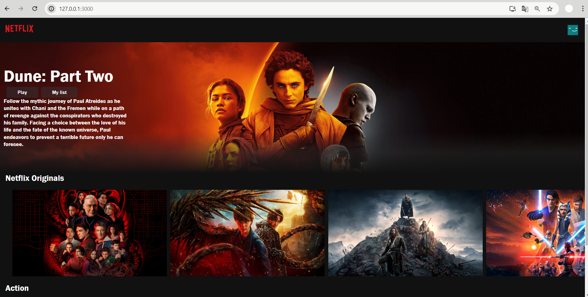

# Netflix Clone - React JS

## Description

This project is a Netflix clone built using React JS. It was created as a part of my learning journey to understand and practice React. 

## Features

- **NavBar**: A top navigation bar with a Netflix logo and user avatar.
- **Banner**: Displays a random trending movie/show from TMDb API as a banner.
- **RowPost**: Renders rows of movie/show posters, which fetch and display YouTube trailers on click. The component is reusable with different props to display various categories of content.

## What I Learned

- **React Components**: Structuring a project with reusable components.
- **State Management**: Using `useState` and `useEffect` hooks to manage component state and side effects.
- **API Integration**: Fetching data from TMDb API using `axios`.
- **Conditional Rendering**: Rendering elements based on state changes.
- **Styling**: Applying CSS for styling components and making them responsive.
- **Component Reusability**: Utilizing props to create flexible and reusable components like `RowPost` for different content categories.

## Reusability of `RowPost`

The `RowPost` component is designed to be reusable with different props:

- **title**: The title of the row (e.g., "Netflix Originals", "Action").
- **url**: The API endpoint to fetch the movies/shows for that row.
- **isSmall**: A boolean to determine the size of the posters.

